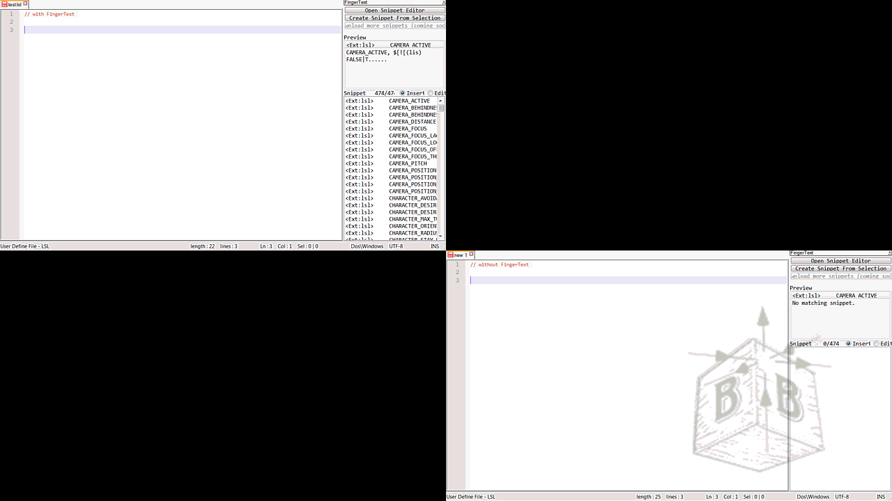

## [Linden Scripting Language](http://wiki.secondlife.com/wiki/LSL_Portal) syntax highlight for [Notepad++](http://notepad-plus-plus.org/)

last update: `2014-03-11`

### Readme contents

* [Quick start](#quick-start)
* [Bugs, issues & feature requests](#bugs-issues--feature-requests)
* [Visit the Builder's Brewery](#visit-the-builders-brewery)
* [LSL Syntax](#lsl-syntax)
* [LSL Autocompletion](#lsl-autocompletion)
* [LSL Snippets via FingerText](#lsl-snippets-via-fingertext)
* [LSL code structure](#lsl-code-structure)

___

### Quick start

* Download:
  * [latest release as *.zip](https://github.com/buildersbrewery/lsl-for-notepadplusplus/archive/master.zip)
  * [latest release as *.tar.gz](https://github.com/buildersbrewery/lsl-for-notepadplusplus/archive/master.tar.gz)
* Clone the repo: `git clone git://github.com/buildersbrewery/lsl-for-notepadplusplus.git`

### Bugs, issues & feature requests

* Please search for [existing issues](https://github.com/buildersbrewery/lsl-for-notepadplusplus/issues/) before opening a [new issue](https://github.com/buildersbrewery/lsl-for-notepadplusplus/issues/new/).

### Visit the Builder's Brewery

* Homepage: [http://www.buildersbrewery.com/](http://www.buildersbrewery.com/)
* In Second Life: [Builders_Brewery/128/154/24/](http://maps.secondlife.com/secondlife/Builders%20Brewery/128/154/24/)
* Calendar with class schedule: [http://www.buildersbrewery.com/calendar/](http://www.buildersbrewery.com/calendar/)

___

### LSL Syntax:

| If `...\Notepad++\userDefineLang.xml` exists where [Notepad++](http://notepad-plus-plus.org/) is installed | If `...\Notepad++\userDefineLang.xml` does not exist where [Notepad++](http://notepad-plus-plus.org/) is installed |
|:---:|:---:|
| Copy and paste everything within and including the `UserLang` tags from the `userDefineLang.xml` file from this repository into the file `...\Notepad++\userDefineLang.xml` where [Notepad++](http://notepad-plus-plus.org/) is installed. | Open [Notepad++](http://notepad-plus-plus.org/) and go to `Language > Define your language > Import` to import a copy of the `userDefineLang.xml` file. You can then delete the file you imported from. |
| When saving changes to the file make sure the file's encoding is `ANSI/ASCII`! | Make sure the encoding of the file you are importing is `ANSI/ASCII`! |

```xml
<?xml version="1.0" encoding="Windows-1252" ?>
<NotepadPlus>
    <UserLang name="someOtherLanguage">
        <!--
            settings
            keyword lists
            styles
        -->
    </UserLang>
    <!--
        add the LSL language here
    -->
</NotepadPlus>
```

* Choose the language via `Language > LSL` from the menu. You should should be able to find it at the bottom of the language menu in the section for user defined languages.


### LSL Autocompletion:

* Copy and paste the `lsl.xml` file from this repository to `...\Notepad++\plugins\APIs\lsl.xml` where Notepad++ is installed.
* Make sure the file's encoding is `ANSI/ASCII`!
* Goto `Settings > Preferences > Backup&Autocompletion` and make sure you set `enable auto-completion on each input` to `function completion` and you enable `function parameter hints on input`.



### LSL Snippets via FingerText:

Install [FingerText](https://github.com/erinata/FingerText) from the [Notepad++](http://notepad-plus-plus.org/) Plugin Manager. Then from the menu go to `Plugins > FingerText > Import Snippets from ftd file` to import the LSL snippets and start working on any file with an `*.lsl`-Extension.

### LSL code structure

Add code snippets from `../Notepad++/functionList.xml` from this repository into `../Notepad++/functionList.xml` where [Notepad++](http://notepad-plus-plus.org/) is installed.
